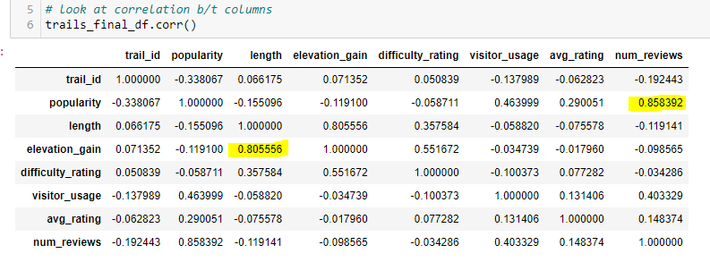

# Nat_Parks_Project

**Project Goals**

Our team aims to work with the United States National Park Service to better understand more than 400 national parks spanning 84 million acres. Through our analysis below, we aim to use machine learning and tableau visualizations to equip our stakeholders with the tools to answer the below questions:

1. Does biodiversity have a correlation with park popularity?
2. What categories can we create to plan investment strategy? 
3. What trail features most affect average rating?

As avid nature lovers ourselves, we understand the importance of our National Parks. We want to aid the department in harnessing the power of data analytics to attract more visitors to the hidden beautiful landscapes the United States has to offer.

## Project Overview:

### Google Slides PowerPoint

[Link to Google Slides](https://docs.google.com/presentation/d/1K_Hdr0zkWgMWZNgbmpIYqnqNQ8xBo2TaI6PAxGkzRgg/edit?usp=sharing)

### Data Pipeline

Our team used Kaggle to source two datasets in CSV Format:

#### Data Sources:

1. [Biodiversity Dataset:](https://www.kaggle.com/datasets/nationalparkservice/park-biodiversity?select=parks.csv)

    a. parks.csv (56 values)

    b. species.csv (119248 values)

2. [Popularity Dataset:](https://www.kaggle.com/datasets/planejane/national-park-trails)

    a. AllTrails data - nationalpark.csv (3288 values)

#### Database Structure: 

Below is an ERD describing the 3 tables we will use in this analysis:

After using Jupyter Notebook to initiate the ETL process on the parks, trail data, and biodiversity tables we chose to use, we saved them as CSV files. We imported the CSV files into PGAdmin in order to run counts and merges in a more visually appealing environment outside of Pandas.

Below is the "trails" database as an example:

Using the "join" SQL code, we were able to make the first workable combined table we will then use for the linear regression analysis.

3 key actions:
* We **joined data from the 2 tables**
* Created a counted data column that **counted the number of trails** per park from the trails_db and **joined that count to parks_db**
* Created a counted data column that **counted the number of species** present per park from the bio_db and **joined that count to parks_db**

#### Data Destination

Upon completing the joins in PGAdmin, we exported the new table as a CSV and imported into Jupyter Notebook in order to continue our analysis and initiate the machine learning modelling.

## Machine Learning Analysis: Models, Results, and Next Steps.

### 1. Does biodiversity have a correlation with park popularity?

#### Algorithm: Linear regression
File: [ML_Linear_Model_Test](ML_Linear_Regression_Test.ipynb)

    a. Hypothesis: If trail popularity is based on biodiversity, then parks with over 20 species in the park have over a 60 popularity score.
    
    b. Null Hypothesis: There is no relationship between the biodiversity and popularity if parks of over 20 species are more often to be less than 60 popularity.

    c. Alternative Hypothesis: If trail popularity is not based on popularity, then parks will have less than 20 species will be above the mean in popularity.

    d. Accepted score: Accepted accuracy score of 0.70

To test our hypothesis that the biodiversity of a park influences the popularity of the trails, we ran a linear regression model to check for correlation. We chose to use the parks dataframe for this test, with the average trail popularity grouped by park, and the total distinct species count per park. 

Independent variable (x): Biodiversity (species count)
Dependent variable (y): Average trail popularity

#### Results: 
The linear regression model showed no correlation, proving the null hypothesis to be true: There is no relationship between the biodiversity and popularity of the park. The accuracy score of the linear regression is -0.017, which is significantly below the threshold we set of 0.70. In the scatter plot and linear regression below, the popularity data points are so dispersed that the line is mainly horizontal and not aligned with the shape of the scatter plot. 

To further explore the data, we used the .corr() method on the trail popularity dataset in order to see which trail features were correlated. The results below show that number of reviews was the closest correlated field to popularity, with 0.86 correlation. Additionally, the trail difficulty is correlated with elevation_gain. 

The fact that popularity is correlated to number of reviews, but not correlated (0.29) to average rating showed us two things:
1. Reviews are subjective. People will rate the park based on their own individual experience and expectations. 
2. If average rating is not correlated to trail popularity, then there must be some hidden gem trails with high ratings and low number of reviews that we should find and present to the parks service for additional marketing investment. 

#### Suggested Next Steps: 
1. Test linear regression or multiple linear regression on other data points to find the real driver of popularity.
    a. Use the Yelp API to get popularity by park for better predictions.
    b. Use a Random Forest model to predict average rating as a category. 
    c. Use the Trails data set to test individual trail popularity with park biodiversity using multiple linear regression on several trail features.
    d. Add calculated fields such as trails per acre and species per acre.

2. Does trail popularity negatively affect biodiversity? 
    a. Use the number of species with a conservation status listed as the target variable. 

### 2. What categories can we create to plan investment strategy? 

#### Machine learning models: PCA and K-Means algorithms
File: [ml_models.ipynb](ml_models.ipynb)

In order to identify the most appropriate way to classify the data into categories of similar trails for funding purposes, we used unsupervised machine learning model techniques including PCA and K-Means algorithms. This took many different data fields from biodiversity and trail use data in one data frame: Biodversity data was aggregated by park in order to be added to the trails dataframe. 

Feature selection: When testing for correlation in the trails dataframe with the pandas .corr() method, we found that average rating and the number of reviews highly rated with popularity. We chose to remove these fields from the machine learning data in order for them to not be overly influential, and decided to only use popularity. The following fields with a # below had to be encoded into numeric format in order to be used in our machine learning models:

Features from trails dataframe included in unsupervised machine learning:

Trail features: 
* popularity
* length
* elevation
* difficulty
* route type #
* features count #
* activities count #

Biodiversity features:
* species count 
* biological category count 
* abundance total (number of species not considered uncommon)
* conservation total (number of species with conservation status)

#### Results:
We used 4 categories of principal components to extract features of the trails dataset for further classification:

We created an elbow curve to find the best value for K:

Further K-Means analysis provided 5 main categories to direct trail investment:

Trail class characteristics for investment planning: 
* Class 0: High biodiversity, low popularity
* Class 1: Avg biodiversity, low popularity
* Class 2: Avg biodiversity, low popularity (difficult trails)
* Class 3: Avg biodiversity, high popularity
* Class 4: Low biodiversity, low popularity 

### 3. What trail features most affect average rating? 

#### Machine learning models: EasyEnsembleClassifier and RandomForest
File: [ml_models.ipynb](ml_models.ipynb)

Features: elevation gain, length, difficulty rating, feature availability, activity availability
Target Variable: average rating

Since we found that biodiversity is not a good indicator of trail popularity, and that popularity largely correlated with average rating, we wanted to perform classification models on only trail features to predict the average rating of a trail. We used Easy Ensemble Classifier to test the accuracy of our data analysis. Then, using the Random Forest model to classify parks by average rating, we used the feature_importances module to see which trail features most influenced their rating. The following fields with a # below had to be encoded into numeric format in order to be used in our machine learning models:

**Feature selection:**

Trail features:
* length
* elevation gain
* difficulty rating
* route type #
* features # 
* activities #

#### Results: 
The resulting accuracy score for our Easy Ensemble Classifier model fit with the trail rating and feature data was low at 0.08. Using the feature importance technique of the Random Forest Classifier, we identified 15 fields which affected the data above 0.02, and used only these fields to rerun the models. 

The second run with only 15 of the trails fields resulted in an accuracy score of 0.11. This low score further supports our findings that the popularity and rating data is very subjective and depends on individual preferences. 

We generated an Imbalanced Classification Report for our model:

However, we used the feature importance of the random forest model to find that the most significant fields for predicting average rating were trail eleveation gain and length:

#### Suggested Next Steps: 
    a. Re-run this analysis using Popularity as a predictor 
    b. Re-run this analysis using Rating as a predictor

## Tableau Dashboard

[Link to Tableau Dashboard](https://public.tableau.com/app/profile/brittney.r.stanley/viz/Parks_Presentation_16598841285810/Storyboard?publish=yes)

### Outline of Final Tableau Storyboard:
* Map of park popularity and biodiversity:
    Visualize the lack of correlation with biodiversity and popularity shown as color and shape features. (use parks_pop_bio.csv)
* Funding Class Comparison Dashboard:
    Using interactive filters on funding class, two charts will show comparisons of biodiversity, trail difficulty, and trail popularity. 
* Dashboard of Charts on Park general data:
    * Top 13 most popular trails!
    * Most biodiverse parks and their number of trails
    * Number of ultra-popular trails per park (above 52.02 popularity)
* Hidden Gem finder: 
    * Most Popular trails with their rating and difficulty
    * Least popular trails that are ranked 5-stars - Hidden Gems that should get increased marketing.

### Tools Used
1. Tableau Worksheets to create visuals

2. Tableau Dashboard to present created visuals with details

3. Saved to Tableau Public and shared as a link for interactive dashboard

### Interactive Tools

1. Interactive map is created to show the most popular parks and their locations with information on trail count, acres, and park name when hovering over data point on map.

2. Interactive bar chart to display the top 13 Parks to visit based on average popularity, trail count is shown with shading, number of acres are shown outside of the bar. More information is given when hovering over bar on the graph.

## Summary

### Project Limitations

1. We used biodiversity data per park, and popularity data per trail.

We attempted averaging the popularity data by park, which standardized it for the linear regression, but effectively changed the data. In reality, popularity of park is very subjective. 

Our future recommendation is to use the Yelp API to get popularity data by park. 

2. Unable to answer original question "What state should we build the next park?". 

In order to answer this we would have to have values for if a state is desireable or undesireable - which we could assign using criteria in the original dataset, and it does not need machine learning.

Our future recommendation is to work with National Parks Service stakeholders to understand priorities for trails in the next parkand get updated usage data for similar trails. 

3. Popularity and Rating are very subjective and difficult to make predictions based on this. 

### What We Would Do Differently

1. We used biodiversity data per park, and popularity data per trail.
    * Use park-level popularity data to better test correlation.
    * Use the trail-level “wildlife” feature instead of park species count.
2. Unable to answer original question "What state should we build the next park?"
    * Agree with stakeholders on “ideal” trail conditions (i.e. difficulty, length, # of features).
    * Find updated trail usage data.

